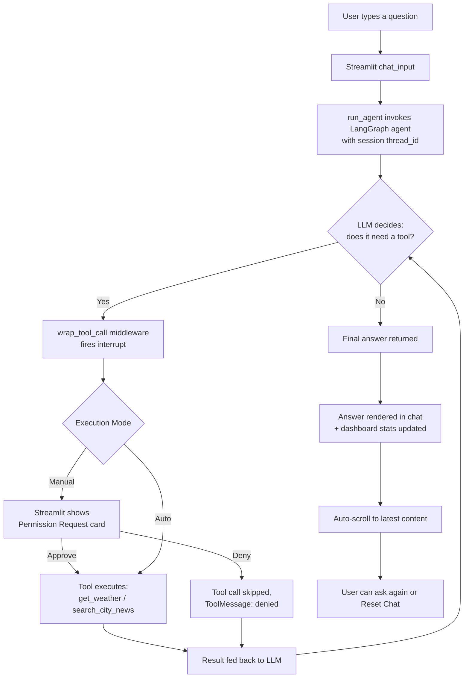

# 🌆 City Assistant

A conversational AI agent that answers questions about **weather** and **local news** for cities in Pakistan — built with **LangChain**, **LangGraph**, and a **Groq**-hosted LLM, and delivered through a custom-designed **Streamlit** dashboard with human-in-the-loop tool approval.

---

## Table of Contents

- [Overview](#overview)
- [Features](#features)
- [Project Structure](#project-structure)
- [Architecture](#architecture)
- [Project Flow](#project-flow)
- [Execution Modes: Manual vs Auto](#execution-modes-manual-vs-auto)
- [Prerequisites](#prerequisites)
- [Setup & Installation](#setup--installation)
- [Configuration](#configuration)
- [Running the App](#running-the-app)
- [Usage Guide](#usage-guide)
- [UI / Dashboard Reference](#ui--dashboard-reference)
- [Tools Reference](#tools-reference)
- [Session & State Management](#session--state-management)
- [Troubleshooting](#troubleshooting)
- [Notes & Limitations](#notes--limitations)

---

## Overview

City Assistant lets a user ask natural-language questions like *"What's the weather in Lahore?"* or *"Any news about Karachi?"*. An LLM-powered agent decides which tool to call to answer — and, depending on the selected mode, either pauses for human approval before running that tool, or runs straight through automatically.

The project is split into two clearly separated layers:

1. **Agent layer** (`LangChain` + `LangGraph`) — the LLM, the two domain tools, the approval middleware, and conversational memory.
2. **UI layer** (`Streamlit`) — a dark, glassmorphic dashboard with live stat cards, a chat interface, a permission-request panel, and sidebar controls.

A console-only version of the same agent logic (`Agent2.py`) is also included, useful for quick terminal testing without the UI.

---

## Features

| Feature | Description |
|---|---|
| 💬 Chat interface | Natural-language Q&A styled as a modern chat window |
| 🌦️ Weather tool | Live current weather for any Pakistani city (OpenWeather API) |
| 📰 News tool | Latest news headlines for a Pakistani city (Tavily Search API) |
| 🔐 Human-in-the-loop approval | Tool calls can pause for an explicit Approve/Deny decision |
| ⚙️ Manual / Auto execution modes | Toggle between "approve everything" and "run straight through" |
| 📊 Live stat dashboard | Animated cards tracking messages, approvals, denials, session ID, and mode |
| 🔄 Reset Chat | Clears history and starts a fresh conversation thread |
| ⬇️ Auto-scroll | Automatically scrolls to the newest message or approval card |
| 🎨 Custom glass/gradient theme | Modern dark SaaS-style design, built entirely with custom CSS |

---

## Project Structure

```
city-assistant/
├── app.py               # Streamlit app: UI, dashboard, agent wiring, approval flow
├── Agent2.py            # Standalone console version of the same agent (no UI)
├── requirements.txt     # Python dependencies
├── .env                 # API keys (you create this — never commit it)
└── README.md            # This file
```

---

## Architecture



**Core components:**

- **`ChatGroq` LLM** (`openai/gpt-oss-120b`) — reasons about the user's request and decides which tool(s), if any, to call.
- **Tools** — plain Python functions decorated with `@tool`:
  - `get_weather(city)` → calls OpenWeather's REST API
  - `search_city_news(city)` → calls Tavily's search API
- **`wrap_tool_call` middleware (`humanApproval`)** — intercepts every tool call and raises a LangGraph `interrupt`, pausing execution until a decision is made.
- **`MemorySaver` checkpointer** — allows the agent's execution to be paused at the `interrupt` and resumed later via `Command(resume=...)`, either by a button click (Manual mode) or automatically (Auto mode).
- **Streamlit session state** — tracks chat history, the current conversation thread ID, pending approvals, counters for the dashboard, and the active execution mode.
- **Auto-scroll script** — a small injected script (via `streamlit.components.v1.html`) that keeps the view pinned to the newest message or approval card.

---

## Project Flow

Step-by-step, from app launch to answer:

1. **App starts** → `.env` is loaded, API keys are read, and the agent is built once and cached (`@st.cache_resource`) so the LLM/tools aren't rebuilt on every rerun.
2. **Session initializes** → a unique `thread_id` is generated for the browser session; chat history, counters, and mode default to empty/Manual.
3. **Sidebar check** → the user can confirm API key status (ONLINE/OFFLINE) and choose **Manual** or **Auto** mode.
4. **User submits a question** in the chat box (e.g. *"weather in Multan"*).
5. **Message is appended** to the visible history and sent to the agent via `agent.invoke(...)`, tied to the session's `thread_id`.
6. **The LLM reasons** about the request and decides whether it needs `get_weather`, `search_city_news`, both, or neither.
7. **If a tool is needed:**
   - The `humanApproval` middleware intercepts the call and raises an `interrupt`.
   - **In Manual mode:** execution pauses, and a **Permission Request** card appears showing the tool name and its arguments as clean key/value rows. The user clicks **✅ Approve** or **❌ Deny**.
     - Approve → `Command(resume="yes")` resumes the graph, the tool runs, and its result is passed back to the LLM.
     - Deny → `Command(resume="no")` resumes the graph, but the tool is skipped and the LLM is told the call was denied.
   - **In Auto mode:** the interrupt is resumed immediately and silently with `"yes"` — no card is shown, and the loop continues until the agent has everything it needs.
8. **If no tool is needed (or once all tool calls are resolved):** the LLM's final response is returned.
9. **Answer is appended** to the chat history, the dashboard stat cards update (message count, approvals, denials), and the page auto-scrolls to the newest content.
10. **User can continue chatting** — the `thread_id` stays the same, so the agent retains conversational context across turns.
11. **Reset Chat** (sidebar button) → generates a new `thread_id`, clears history and counters, and starts a completely fresh conversation with no memory of the old one.

---

## Execution Modes: Manual vs Auto

| Mode | Behavior | Best for |
|---|---|---|
| **Manual** (default) | Every tool call pauses and shows a Permission Request card; nothing runs without an explicit Approve | Reviewing exactly what the agent wants to do before it does it |
| **Auto** | Tool calls are approved automatically behind the scenes; you just ask and get an answer | Fast, uninterrupted back-and-forth once you trust the agent's behavior |

The active mode is shown live in the sidebar toggle and in the **MODE** stat card on the dashboard. Switching modes takes effect immediately on the next message.

---

## Prerequisites

- Python 3.9 or higher
- API keys for:
  - **Groq** — LLM inference
  - **OpenWeather** — weather data
  - **Tavily** — news/web search

---

## Setup & Installation

1. **Get the project files** (`app.py`, `Agent2.py`, `requirements.txt`) into a folder.

2. **Create and activate a virtual environment:**
   ```bash
   python -m venv venv
   source venv/bin/activate      # Windows: venv\Scripts\activate
   ```
   *(or, with `uv`: `uv venv` then `.venv\Scripts\activate` on Windows)*

3. **Install dependencies:**
   ```bash
   pip install -r requirements.txt
   ```
   *(or: `uv pip install -r requirements.txt`)*

---

## Configuration

Create a `.env` file in the project root (same folder as `app.py`):

```env
GROQ_API_KEY=your_groq_api_key_here
OPENWEATHER_API_KEY=your_openweather_api_key_here
TAVILY_API_KEY=your_tavily_api_key_here
```

> The sidebar shows **ONLINE** / **OFFLINE** status for the OpenWeather and Tavily keys, so you can quickly confirm your `.env` is being picked up correctly.

---

## Running the App

```bash
streamlit run app.py
```

Streamlit prints a local URL (typically `http://localhost:8501`) — open it in your browser. The sidebar opens automatically on load.

To run the console-only version instead:

```bash
python Agent2.py
```

---

## Usage Guide

1. Open the app — the sidebar is expanded by default, showing API key status and the Manual/Auto toggle.
2. Type a question into the chat box, for example:
   - *"What's the weather in Islamabad?"*
   - *"Give me the latest news about Faisalabad."*
3. **In Manual mode**, a **🔐 Permission Request** card appears showing:
   - The tool's name (`get_weather` or `search_city_news`)
   - Its arguments, shown as labeled rows (e.g. `CITY → Lahore`)

   Click **✅ Approve** to let it proceed, or **❌ Deny** to block that specific call.
4. **In Auto mode**, skip the card entirely — just read the agent's reply once it's ready.
5. Watch the dashboard update: message count, approvals, and denials tick up live.
6. Click **🔄 Reset Chat** in the sidebar anytime to start over with a clean slate.

---

## UI / Dashboard Reference

| Element | Purpose |
|---|---|
| **Header banner** | Animated gradient title bar with the app name |
| **Sidebar hint banner** | Reminds the user that Mode and Reset Chat live in the sidebar |
| **Stat cards** | `MESSAGES`, `TOOLS APPROVED`, `TOOLS DENIED`, `SESSION ID`, `MODE` — live counters with hover and entrance animations |
| **Chat window** | Scrollable message history, styled distinctly for user vs. assistant turns |
| **Permission Request card** | Shown only in Manual mode when a tool call is pending |
| **Sidebar** | API key status, Manual/Auto toggle, Reset Chat button |
| **Auto-scroll** | Keeps the latest message or approval card in view without manual scrolling |

---

## Tools Reference

### `get_weather(city: str) -> str`
Fetches current weather conditions for a city in Pakistan from the OpenWeather API.
Returns: city name, temperature, feels-like temperature, humidity, description, and wind speed.

### `search_city_news(city: str) -> str`
Searches for the two most relevant recent news items about a city in Pakistan using Tavily.
Returns: titles and short content snippets (truncated to 500 characters each).

---

## Session & State Management

| State key | Purpose |
|---|---|
| `st.session_state.messages` | Full visible chat history for the current browser session |
| `st.session_state.thread_id` | Unique ID passed to the LangGraph checkpointer so the agent remembers context across turns |
| `st.session_state.pending_approval` | Holds the tool name/args currently awaiting a human decision (Manual mode only) |
| `st.session_state.approved_count` | Running count of approved tool calls, shown on the dashboard |
| `st.session_state.denied_count` | Running count of denied tool calls, shown on the dashboard |
| `st.session_state.mode` | Current execution mode — `"Manual"` or `"Auto"` |

The agent itself (LLM + tools + middleware + checkpointer) is created once per app process via `@st.cache_resource`, so only the conversation thread and session state change between interactions — not the underlying agent.

---

## Troubleshooting

| Issue | Likely Cause | Fix |
|---|---|---|
| "OpenWeather API key is missing" | `.env` not loaded or key name mismatched | Confirm `.env` is in the same folder as `app.py` and uses `OPENWEATHER_API_KEY` |
| No news results returned | Tavily key missing/invalid, or no results for that query | Check the sidebar status indicator; verify `TAVILY_API_KEY` |
| App won't start / import errors | Missing dependency | Re-run `pip install -r requirements.txt` inside your virtual environment |
| Approval card doesn't appear | App is in **Auto** mode | Switch to **Manual** in the sidebar to see the Permission Request card |
| Page doesn't scroll to new content | Browser extension blocking the embedded script | Scroll manually, or try a different browser/profile |
| Sidebar is collapsed on load | Streamlit remembered a previous session's state | Click the **»** icon top-left to re-expand it |

---

## Notes & Limitations

- This app preserves the **exact same agent logic** (tools, LLM, system prompt) as the original console-based script (`Agent2.py`) — the UI layer adds the dashboard, the Manual/Auto toggle, and the approval workflow adapted for the browser, since a blocking terminal `input()` can't run inside a web app.
- Conversation memory is kept only for the current session (in-memory checkpointer) — restarting the Streamlit server clears all threads.
- The weather tool is scoped to cities in Pakistan (`,PK` is appended to every query).
- Dashboard counters (`approved_count`, `denied_count`) reset whenever **Reset Chat** is clicked, along with the chat history and thread ID.
